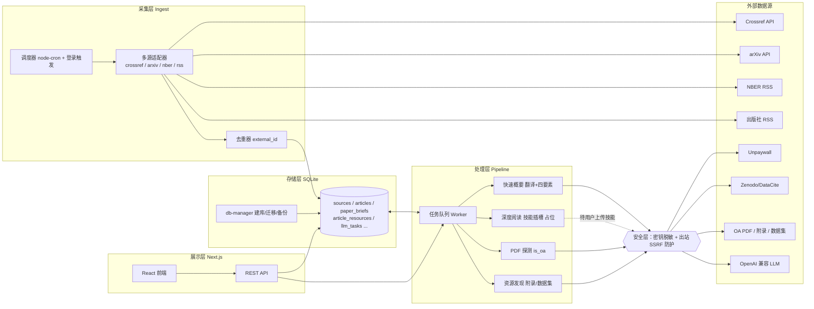
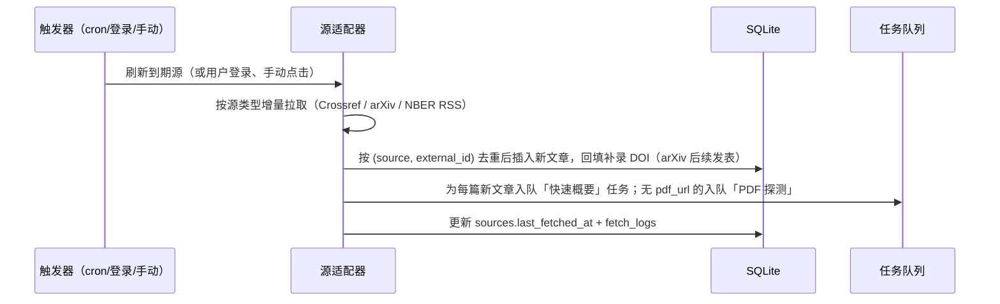

# 系统架构设计（v3）

## 1. 架构总览

单体全栈应用，逻辑上分为四层：**采集层 → 存储层 → 处理层 → 展示层**；
安全控制（密钥防护 + 出站防护）横切所有出站调用。



## 2. 模块划分

| 模块 | 目录 | 职责 | 依赖 |
| --- | --- | --- | --- |
| 抓取调度 | `server/scheduler` | node-cron 按源间隔触发；登录时按用户设置触发增量刷新；手动刷新入口 | ingest |
| 多源抓取适配器 | `server/ingest/adapters/` | `crossref.ts`（期刊，ISSN 增量）、`arxiv.ts`（官方 API，按学科分类）、`nber.ts`（官方 RSS）、`crossref-books.ts`（书籍，`type=book` 按出版社）、`rss.ts`（出版社补充） | 各平台 HTTP |
| 去重器 | `server/ingest/dedupe.ts` | `(source_id, external_id)` 唯一：期刊=DOI，arXiv=arXiv id，NBER=工作论文编号 | — |
| PDF 发现 | `server/pipeline/pdf-probe.ts` | Crossref `link` → Unpaywall 兜底，得到 OA PDF 直链并标记 `is_oa` | Unpaywall |
| 任务队列 | `server/pipeline/queue.ts` | SQLite 持久化队列：领取、并发控制、优先级、重试退避、失败上限 | db |
| 快速概要生成 | `server/pipeline/brief.ts` | 一次 LLM 调用：翻译标题/摘要 + 生成四要素概要（领域/类型/问题/结论），类型按预设五分类多标签 | LLM client |
| 论文类型分类学 | `server/pipeline/paper-types.ts` | 五类定义常量表，注入系统提示词，保证分类一致 | — |
| 资源发现 | `server/pipeline/resource-discovery.ts` | 附录/补充材料关键词扫描 + Unpaywall OA 位置 + Zenodo/DataCite 数据集反查，写入 article_resources | Unpaywall, Zenodo |
| 深度阅读插槽 | `server/deep-read/`（占位） | 定义 `ReaderSkill` 接口（输入：文章+PDF 文本+论文类型 → 输出：Markdown 笔记）；与未来「阅读笔记平台」共用同一技能；未接入时接口返回 501 | 待定 |
| 模块注册表 | `lib/modules.ts` | 导航与模块状态注册（可用/规划中），app shell 据此渲染导航与占位页（见 §4） | — |
| LLM 客户端 | `server/llm/client.ts` | OpenAI 兼容调用：超时、并发+RPM 限流、重试、用量统计；日志与错误信息自动脱敏 | env 配置 |
| 数据库管理 | `server/db/db-manager.ts` | 建库、numbered 迁移、WAL、备份、统计、健康检查 | better-sqlite3 |
| 数据访问 | `server/db/repositories` | 各表 repository；唯一暴露读写入口 | db |
| 安全 | `server/security/` | `mask.ts` 密钥脱敏；`ssrf-guard.ts` 出站 URL 校验 | — |
| REST API | `app/api/*` | 鉴权 + zod 校验 + 调用 server 模块 | server |
| 前端 UI | `app/(main)/*`, `components/*` | 信息流、源中心、设置等页面 | API |

设计原则：`src/server` 不依赖 React/Next，可独立单测；API 层薄、逻辑下沉到 server 模块。

## 3. 核心数据流

### 3.1 多源采集管线（自动定时 / 登录触发 / 手动）



- 期刊：Crossref 以 `last_fetched_at` 作 `from-created-date` 增量，`sort=created&order=desc`，附 `mailto` 进入 polite pool；可选出版社 RSS 抢时效（无 DOI 时按标题回查补全）。
- arXiv：官方 API（`export.arxiv.org/api/query`）按订阅的学科分类轮询，以提交时间增量，arXiv id 去重。
- NBER：官方 RSS（new working papers），按条目链接/编号去重。
- 书籍：Crossref `filter=type:book,from-created-date:...` 按订阅的出版社增量拉取；书条目仅走概要管线（降级翻译+基本信息），**不进入** pdf_probe / resource_discovery / deep_read。
- 首次添加源时回填最近 30 天历史（可配置）。

### 3.2 快速概要管线（后台自动，默认卡片内容）

- 新文章入库即入队 `brief` 任务；Worker 批量处理（一次请求 1~5 篇），并发默认 2。
- 一次 LLM 调用同时产出：`title_zh`、`abstract_zh`、四要素概要（研究领域 / 论文类型多标签 / 研究问题 / 研究结论），强制 JSON Schema 输出。
- 论文类型按 `paper-types.ts` 五分类定义（量化实证 / 质性研究 / 模型 / 方法论 / 理论），允许多标签交叉。
- 摘要缺失时降级为 `quality=partial`（仅翻译标题），卡片明示"原文未提供摘要"。
- 失败重试 3 次（指数退避），超限标记 `failed`，前端显示"生成失败，可重试"。
- 结果按 `(article_id, content_hash, model)` 缓存，原文更新则失效重生成。
- 时效目标：新文章入库后 ≤ 5 分钟出现概要。

### 3.3 深度阅读管线（预留占位，需 PDF）

```
卡片「深度阅读」→ POST /api/articles/:id/deep-read
→ 未接入技能：返回 501 {error:"技能未安装"}
→ 接入后：入队 deep_read 任务（优先）→ 下载 PDF → 抽文本
→ 按论文类型调用用户上传的阅读技能 → Markdown 笔记持久化 → 前端轮询渲染
```

- 插槽接口 `ReaderSkill` 现在即定义并冻结（见 `server/deep-read/`），技能未上传前 UI 入口置灰并提示"技能开发中"。
- 与未来「阅读笔记平台」共用：笔记平台复用同一技能文件，另增 Obsidian vault 目录配置与 PDF 上传入口，笔记写入 vault 指定目录（见 §4）。

### 3.4 资源发现管线（附录 / 数据集 / Dataverse）

```
用户点击「查找附录/数据」→ 入队 resource_discovery（优先）
→ ① 扫描文章元数据/摘要中的 appendix / supplement / replication 线索与链接（免费）
→ ② Unpaywall 返回的 OA 位置里筛附录类资源（免费）
→ ③ 以 DOI 反查 Zenodo / DataCite 关联数据集（免费）
→ 结果写入 article_resources，前端渲染下载/跳转链接（新标签页打开）
```

- 用户触发（非全量自动），控制出站请求量；结果缓存，重复点击直接返回。
- 找不到时明示"未发现附录/数据集"。

### 3.5 前端数据流

- 信息流使用服务端组件直读 DB 首屏 + 客户端无限滚动（游标分页）。
- 新文章感知：前端每 60s 轮询 `GET /api/articles/updates?since=<游标>`，有更新时顶部提示"有 N 篇新文章"，点击后刷新（避免打断阅读）。

## 4. 平台扩展架构（预留模块）

预留模块（学术会议 / 基金资助 / 项目管理 / 阅读笔记）遵循统一扩展约定，保证"现在留入口、以后加功能"成本最低：

| 约定 | 说明 |
| --- | --- |
| 模块注册表 | `lib/modules.ts` 集中定义导航项 `{key, route, label, icon, status: "active"\|"planned"}`；app shell 据此渲染导航，新增模块只改注册表 |
| 路由隔离 | 预留模块各为独立路由组 `(reserved)/conferences` 等，当前渲染统一占位页组件（标题 + 一句话定位 + 状态徽章），不写任何业务逻辑与数据表 |
| 接口约定 | `/api/<module>/*` 未启用前统一返回 501；启用后沿用 api-design 的鉴权、zod 校验与错误码约定 |
| 数据演进 | 不为预留模块提前建表；启用时经 db-manager 追加 numbered 迁移，与现有表解耦 |
| 阅读笔记专项预留 | 除通用约定外另两项：① `user_settings.obsidian_vault_path`（vault 目录，自托管部署保证本地文件系统可写）；② 上传 PDF → 抽文本 → `ReaderSkill` → 写入 vault 指定目录 + 存 DB 记录的管线设计，与卡片「深度阅读」同源 |
| 部署约束 | 自托管形态是前提：会议/基金/笔记模块后续都可能需要本地文件/定时任务能力，均沿用现有 scheduler + db-manager 基础设施 |

## 5. 调度与部署

| 项 | 方案 |
| --- | --- |
| 定时调度 | 进程内 node-cron；每 30 分钟扫描一次到期源（`fetch_interval_min`），同源串行 |
| 登录自动刷新 | 登录成功后按 `user_settings.auto_refresh_on_login` 异步触发该用户订阅源的**增量**刷新（只抓到期的），不阻塞页面 |
| 频率偏好 | `user_settings.refresh_interval_min` 作用于登录刷新判断与调度参考；全局扫描周期保持 30 分钟 |
| 手动刷新 | 顶栏「立即刷新」（全部订阅源）+ 源中心单源「立即更新」 |
| 队列 Worker | 与 Web 进程同进程运行（`instrumentation.ts` 注册，避免 dev HMR 重复启动） |
| 部署 | `npm run build && npm start`；提供 Dockerfile，数据卷挂载 `data/`（含备份目录） |

## 6. 错误处理与可靠性（摘要）

| 场景 | 策略 |
| --- | --- |
| 上游限流/超时（Crossref/LLM/PDF） | 重试 3 次指数退避；记入日志，不影响其他任务 |
| 预印本后续正式发表 | arXiv id 与 DOI 双向补录，信息流去重展示 |
| 进程重启 | 队列与游标持久化于 SQLite；`processing` 超 10 分钟重置为 `pending` |
| 数据一致性 | 唯一约束兜底；写入走 repository 事务 |

完整错误矩阵见 [roadmap.md §3 风险与对策](./roadmap.md)。

## 7. 安全设计（多轮防护）

LLM API Key 等用户凭证是最高敏感资产，按"存储 → 暴露面 → 请求 → 配额 → 审计"五层防护：

| # | 层 | 措施 |
| --- | --- | --- |
| 1 | 存储 | 密钥只存 `.env.local`（`.gitignore`）与服务器进程内存；**任何情况下不写入数据库、不返回给前端**；部署文档说明文件权限 600 |
| 2 | 启动自检 | 启动时验证 Key 格式与连通性（一次最小调用）；失败仅提示"密钥无效"，不回显密钥内容；admin 面板仅显示 `sk-****1234` 脱敏值 |
| 3 | 日志与错误脱敏 | 统一日志层：请求头、环境变量、任务错误信息输出前经 `mask.ts` 过滤，匹配密钥/`Authorization` 模式即替换为 `***`；错误响应对上游细节只返回类别码，不附原文 |
| 4 | 出站防护（SSRF） | 所有服务端代发的请求（PDF 下载、元数据查询、资源发现）经 `ssrf-guard.ts`：仅 http/https、DNS 解析后拒绝内网/环回/保留段、限 80/443 端口、拒绝 302 到内网；PDF/资源下载域名白名单（出版社、arxiv.org、unpaywall、zenodo、*.dataverse.org 等，可配置） |
| 5 | 配额与限流 | LLM 并发与 RPM 可配置；用户触发接口限流；登录刷新防抖 60s 防刷；所有 API 入参 zod 校验 |

另：鉴权用 NextAuth credentials + bcrypt + httpOnly cookie；首个管理员经 `ADMIN_EMAIL` 初始化，开放注册可关闭；出站请求统一 UA 与超时，遵守 Crossref/Unpaywall/arXiv 使用条款。

## 8. 测试策略

| 层 | 方式 |
| --- | --- |
| 抓取/管线 | Vitest 单测，HTTP 用录制的 Crossref/arXiv/NBER fixture（不打真实网络） |
| LLM 调用 | 客户端接口抽象，测试注入 fake client |
| 安全 | 断言密钥不出现在任何日志/响应字符串；ssrf-guard 拦截内网地址与非法协议的用例 |
| API | Vitest + 内存 SQLite，覆盖鉴权与分页 |
| 前端 | 关键交互（订阅、刷新、资源查找）用 Playwright 冒烟 |
