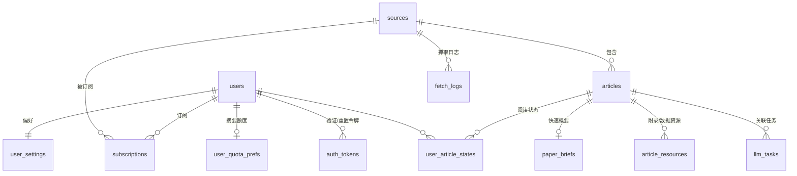

# 数据模型设计（v3）

数据库：SQLite（better-sqlite3，WAL 模式），由专门的数据库管理模块
`server/db/db-manager.ts` 负责建库、迁移、备份与统计。
时间统一存 ISO8601 字符串。

## 1. ER 关系

## 2. 表结构

### users — 用户

| 字段 | 类型 | 说明 |
| --- | --- | --- |
| id | INTEGER PK | |
| email | TEXT UNIQUE | 登录名 |
| password_hash | TEXT | bcrypt |
| name | TEXT | 显示名 |
| role | TEXT | `admin` / `user` |
| email_verified_at | TEXT NULL | 006 迁移；邮箱验证时间，NULL=未验证（存量用户迁移时置为已验证） |
| login_attempts | INTEGER | 006 迁移；连续登录失败次数，默认 0 |
| locked_until | TEXT NULL | 006 迁移；锁定截止时间（连续 5 次失败锁 15 分钟） |
| created_at | TEXT | |

### auth_tokens — 验证/重置令牌（006 迁移）

| 字段 | 类型 | 说明 |
| --- | --- | --- |
| id | INTEGER PK | |
| user_id | INTEGER FK→users | ON DELETE CASCADE |
| kind | TEXT | `verify`（邮箱验证）/ `reset`（重置密码，预留） |
| token_hash | TEXT UNIQUE | SHA-256 哈希；原文仅出现在邮件链接 |
| expires_at | TEXT | 24 小时有效 |
| used_at | TEXT NULL | 一次性，使用后回写 |
| created_at | TEXT | |

索引：`idx(user_id, kind)`

### sources — 订阅源（期刊与预印本统一管理）

| 字段 | 类型 | 说明 |
| --- | --- | --- |
| id | INTEGER PK | |
| kind | TEXT | `journal` / `arxiv` / `nber` / `book`（预留 `ssrn`） |
| identifier | TEXT | 期刊=ISSN；arXiv=学科分类（如 `econ.EM`）；NBER=`nber`；书籍=出版社标识 |
| name | TEXT | 刊名 / 分类显示名 |
| publisher | TEXT NULL | 出版社或平台名 |
| rss_url | TEXT NULL | 补充 RSS 源（期刊可选，NBER 固定） |
| fetch_interval_min | INTEGER | 抓取间隔，默认 30 |
| last_fetched_at | TEXT NULL | 增量游标（Crossref 用时间；arXiv 用提交时间；NBER 用条目日期） |
| active | INTEGER | 0=暂停抓取 |
| is_baseline | INTEGER | 004 迁移；1=基线源（抓取+摘要由开发者全局模型承担），默认 0 |

索引：`UNIQUE(kind, identifier)`

### subscriptions — 用户订阅

| 字段 | 类型 | 说明 |
| --- | --- | --- |
| user_id | INTEGER FK→users | |
| source_id | INTEGER FK→sources | |
| created_at | TEXT | |

索引：`UNIQUE(user_id, source_id)`

### articles — 文章 / 工作论文

| 字段 | 类型 | 说明 |
| --- | --- | --- |
| id | INTEGER PK | |
| source_id | INTEGER FK→sources | |
| external_id | TEXT | DOI / arXiv id / NBER 编号，与 source_id 联合唯一 |
| doi | TEXT NULL | 有则填（预印本后续发表可补录） |
| isbn | TEXT NULL | ISBN（书籍；书籍无 DOI 时 external_id 用 ISBN） |
| title | TEXT | 英文原标题 |
| authors | TEXT | JSON 数组 |
| abstract | TEXT NULL | 英文摘要（可能缺失） |
| volume | TEXT NULL | 卷（期刊） |
| issue | TEXT NULL | 期（期刊） |
| page | TEXT NULL | 页码（期刊） |
| published_at | TEXT | 发表/提交时间（兼容字段，取 online 优先） |
| published_online | TEXT NULL | Online 首发日期（Crossref `published-online`） |
| published_print | TEXT NULL | 纸质发表日期（Crossref `published-print`） |
| url | TEXT | 官方落地页 |
| cover_url | TEXT NULL | 封面图链接（书籍） |
| pdf_url | TEXT NULL | OA PDF 直链 |
| is_oa | INTEGER | 是否开放获取 |
| incomplete | INTEGER | 元数据不完整标记 |
| created_at | TEXT | 入库时间 |

索引：`UNIQUE(source_id, external_id)`、`idx(source_id, created_at DESC)`、`idx(created_at DESC)`、`idx(doi)`

### paper_briefs — 快速概要（1:1，默认卡片内容）

| 字段 | 类型 | 说明 |
| --- | --- | --- |
| article_id | INTEGER PK FK→articles | |
| title_zh | TEXT | 中文标题 |
| abstract_zh | TEXT NULL | 中文摘要 |
| field | TEXT | 研究领域（中文短语） |
| paper_types | TEXT | JSON 多标签，取值见分类学 |
| research_question | TEXT | 研究问题（中文，1~2 句） |
| conclusion | TEXT | 研究结论（中文，1~3 句） |
| quality | TEXT | `full`（信息充足）/ `partial`（摘要缺失，降级为仅翻译） |
| content_hash | TEXT | 原文哈希，原文变更则失效 |
| model | TEXT | 生成模型 |
| updated_at | TEXT | |

**论文类型分类学（五分类，非互斥，多标签）**：

| 取值 | 定义 |
| --- | --- |
| `quant_empirical` | 量化实证：用统计/计量方法分析经验数据检验假设 |
| `qualitative` | 质性研究：访谈、案例、民族志、扎根理论等非数值化方法 |
| `model` | 模型：构建数学/理论/计算模型推导或模拟现象 |
| `methodology` | 方法论研究：提出或改进研究方法、算法、测量工具 |
| `theory` | 理论研究：概念框架、综述、理论命题构建与批判 |

分类定义在代码中以常量表维护（`server/pipeline/paper-types.ts`），
作为系统提示词的一部分注入，保证分类一致性；后续可扩展。

### article_resources — 附录 / 数据集 / Dataverse

| 字段 | 类型 | 说明 |
| --- | --- | --- |
| id | INTEGER PK | |
| article_id | INTEGER FK→articles | |
| kind | TEXT | `appendix` / `dataset` / `dataverse` |
| label | TEXT | 展示名（如 "Appendix A"、"Replication Data for ..."） |
| url | TEXT | 下载或跳转链接 |
| found_via | TEXT | `auto`（元数据扫描）/ `manual`（用户触发发现） |
| created_at | TEXT | |

索引：`UNIQUE(article_id, kind, url)`

### user_settings — 用户偏好

| 字段 | 类型 | 说明 |
| --- | --- | --- |
| user_id | INTEGER PK FK→users | |
| auto_refresh_on_login | INTEGER | 登录时自动增量刷新，默认 1 |
| refresh_interval_min | INTEGER | 期望刷新频率（分钟），默认 30 |
| default_lang | TEXT | 默认展示语言，`zh` |
| obsidian_vault_path | TEXT NULL | 预留：Obsidian vault 目录（阅读笔记平台用，见 architecture §4） |

### user_article_states — 阅读状态

| 字段 | 类型 | 说明 |
| --- | --- | --- |
| user_id | INTEGER FK | |
| article_id | INTEGER FK | |
| is_read | INTEGER | |
| is_starred | INTEGER | |
| updated_at | TEXT | |

索引：`PK(user_id, article_id)`

### llm_tasks — 任务队列

| 字段 | 类型 | 说明 |
| --- | --- | --- |
| id | INTEGER PK | |
| type | TEXT | `brief`（翻译+快速概要）/ `pdf_probe` / `resource_discovery` / `deep_read`（预留） |
| article_id | INTEGER FK→articles | |
| status | TEXT | `pending` / `processing` / `done` / `failed` / `no_pdf` |
| priority | INTEGER | 数值大优先；概要任务分档：手动 8 > 基线 6 > 个人优先源 4 > 个人普通 2 |
| user_id | INTEGER FK→users NULL | 004 迁移；个人概要任务归属用户（基线任务为 NULL），ON DELETE SET NULL |
| attempts | INTEGER | 已重试次数 |
| run_after | TEXT | 退避调度时间 |
| error | TEXT NULL | 最近错误信息（脱敏后） |
| created_at / updated_at | TEXT | |

索引：`idx(status, run_after, priority DESC)`

### fetch_logs — 抓取日志

| 字段 | 类型 | 说明 |
| --- | --- | --- |
| id | INTEGER PK | |
| source_id | INTEGER FK | |
| started_at / finished_at | TEXT | |
| new_count | INTEGER | 本次新增文章数 |
| error | TEXT NULL | |

### llm_usage — Token 消耗日志（002 迁移）

| 字段 | 类型 | 说明 |
| --- | --- | --- |
| id | INTEGER PK | |
| task_type | TEXT | `brief` / `deep_read` / `notes` |
| model | TEXT | 实际使用模型 |
| prompt_tokens / completion_tokens / total_tokens | INTEGER | 本次消耗 |
| article_id | INTEGER FK→articles NULL | ON DELETE SET NULL |
| created_at | TEXT | |

索引：`idx(created_at)`；仪表盘按日 × 4 时段（深夜/上午/下午/晚间）聚合。

### llm_providers — 模型配置（002 迁移）

| 字段 | 类型 | 说明 |
| --- | --- | --- |
| id | INTEGER PK | |
| user_id | INTEGER FK→users | |
| slot | TEXT | `brief`（快速概要，全局共享，管理员配置）/ `brief_personal`（个人概要，范围外自动摘要）/ `notes`（阅读笔记，每用户）；005 迁移重建表放宽 CHECK 为三槽 |
| base_url / model | TEXT | 提供商端点与模型名 |
| api_key_enc | TEXT | AES-256-GCM 密文（密钥派生自 AUTH_SECRET，见 security/crypto.ts） |
| updated_at | TEXT | |

索引：`UNIQUE(user_id, slot)`；brief 解析取最近更新一条，未配置时回退 `.env.local`。

### feedbacks — 用户反馈（003 迁移）

| 字段 | 类型 | 说明 |
| --- | --- | --- |
| id | INTEGER PK | |
| user_id | INTEGER FK→users | ON DELETE CASCADE |
| summary | TEXT | 问题概述（必填，≤200 字） |
| detail | TEXT | 详情描述（≤5000 字） |
| attachments | TEXT | JSON 数组，附件相对路径（`YYYYMM/<uuid>.<ext>`），文件落盘 `data/uploads/` |
| status | TEXT | 默认 `open` |
| created_at | TEXT | UTC |

索引：`idx_feedbacks_user(user_id, created_at)`。

### user_quota_prefs — 个人自动摘要额度偏好（004 迁移）

| 字段 | 类型 | 说明 |
| --- | --- | --- |
| user_id | INTEGER PK FK→users | ON DELETE CASCADE |
| brief_daily_cap | INTEGER | 每日自动摘要上限（篇数），默认 20；0=仅手动触发 |
| priority_source_ids | TEXT | JSON 数组，优先摘要的订阅源 id（仅影响调度顺序） |
| updated_at | TEXT | |

额度核算不加列：按 `llm_usage.task_type='brief'` JOIN `articles → sources(is_baseline=0) → subscriptions(user_id)` 计当日 DISTINCT 文章数。

### note_materials — 读书笔记材料（007 迁移）

| 字段 | 类型 | 说明 |
| --- | --- | --- |
| id | INTEGER PK | |
| user_id | INTEGER FK→users | ON DELETE CASCADE |
| kind | TEXT | `main`（论文正文，仅 .pdf/.epub）/ `attachment`（附加材料，仅 .pdf/.zip），CHECK 约束 |
| original_name | TEXT | 原始文件名 |
| stored_path | TEXT | 相对路径 `YYYYMM/<uuid>.<ext>`，文件落盘 `data/note-materials/` |
| size | INTEGER | 字节数（单文件 ≤50MB） |
| created_at | TEXT | UTC |

索引：`idx_note_materials_user(user_id, created_at)`。

## 3. 数据库管理模块（db-manager.ts）

| 能力 | 说明 |
| --- | --- |
| 建库与迁移 | 启动时按文件名顺序扫描 `schema/` 下 numbered SQL（001…007），`schema_version` 表记录已应用版本，逐版本事务应用 |
| 连接配置 | WAL 模式、busy_timeout、外键开启 |
| 备份 | `backup()` → SQLite Online Backup API 复制到 `data/backups/YYYYMMDD-HHmm.db`；admin 手动触发，后续可加定时 |
| 统计 | 各表行数、库体积、最近抓取/任务情况，供 admin 面板 |
| 健康检查 | 启动自检：可写性、磁盘空间阈值告警 |

## 4. 约束与清理策略

- 文章保留最近 12 个月（超出定时清理，被收藏文章除外）；概要/资源随文章级联删除。
- `fetch_logs` 保留 30 天。
- 所有外键 `ON DELETE CASCADE`。

## 5. 预留说明

- 学术会议 / 基金资助 / 项目管理三个预留模块**当前不建表**；启用时经 db-manager 追加独立 numbered 迁移，与现有表解耦（见 architecture §4）。阅读笔记已起步：007 迁移建 `note_materials` 表承接材料上传，笔记自动生成待后续迁移扩展。
- `sources.kind` 已预留 `ssrn` 取值；书籍（`book`）复用 articles 表，仅 `isbn` / `cover_url` 为书籍专属字段。
- 书籍条目不产生 `article_resources` 与深度阅读记录（无全文）。
